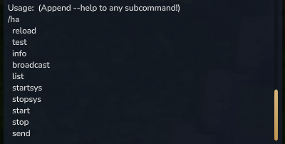
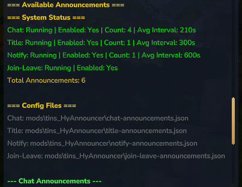
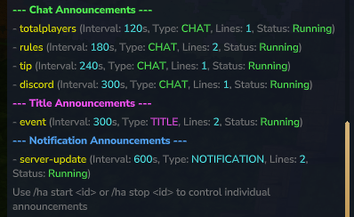
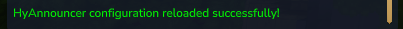

# Commands

All commands require OP permissions:

| Command | Description |
|---------|-------------|
| `/ha` or `/hyannouncer` or `/announce` | Main command (shows help) |
| `/ha info` | Show mod information, version, and Discord link |
| `/ha reload` | Reload all configuration files and restart announcements with new settings (no server restart required) |
| `/ha test` | Test all announcements immediately |
| `/ha broadcast <id>` or `/ha bc <id>` | Manually trigger a specific announcement |
| `/ha list` or `/ha ls` or `/ha status` | List all available announcements with details |
| `/ha gui` | Open the interactive GUI for managing announcements |

### Command Examples

#### Main Command Help

#### Info Command

**Command:** `/ha info`

Displays mod information including version, active announcements count, and Discord link.

#### List Command

**Command:** `/ha list` or `/ha ls` or `/ha status`

Lists all configured announcements with their details.

#### Reload Command

**Command:** `/ha reload`

Reloads all configuration files and restarts announcements with new settings.

#### Test Command

**Command:** `/ha test`

Immediately sends all enabled announcements to all online players.

.png)

#### System Control Commands

**Commands:** `/ha startsys` and `/ha stopsys`

Control announcement systems. When run without arguments, shows the status of all systems.

.png)

### System Control Commands

| Command | Description |
|---------|-------------|
| `/ha startsys [chat\|title\|notify\|joinleave\|all]` | Start specific announcement systems |
| `/ha stopsys [chat\|title\|notify\|joinleave\|all]` | Stop specific announcement systems |
| `/ha start <id>` | Start a specific announcement by ID |
| `/ha stop <id>` | Stop a specific announcement by ID |

### Manual Send Commands

| Command | Description |
|---------|-------------|
| `/ha send chat <message>` | Send a chat message to all players |
| `/ha send title "title" "subtitle"` | Send a title message to all players (two quoted strings for title and subtitle) |
| `/ha send notification <message>` | Send a notification to all players |
| `/ha sendplayer chat <player> <message>` | Send a chat message to a specific player |
| `/ha sendplayer title <player> "title" "subtitle"` | Send a title message to a specific player (two quoted strings) |
| `/ha sendplayer notification <player> <message>` | Send a notification to a specific player |
