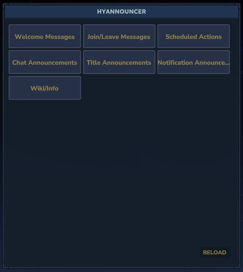
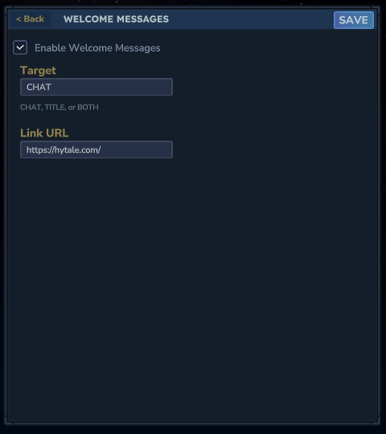
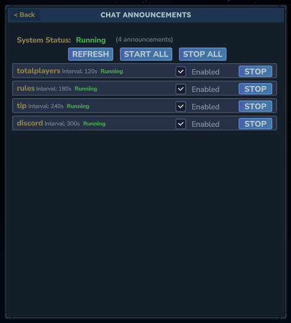
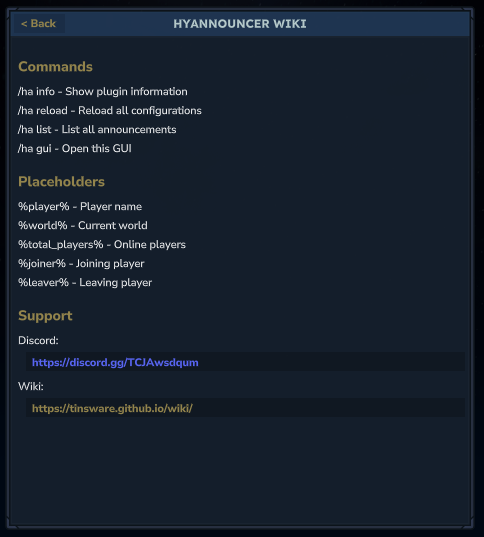
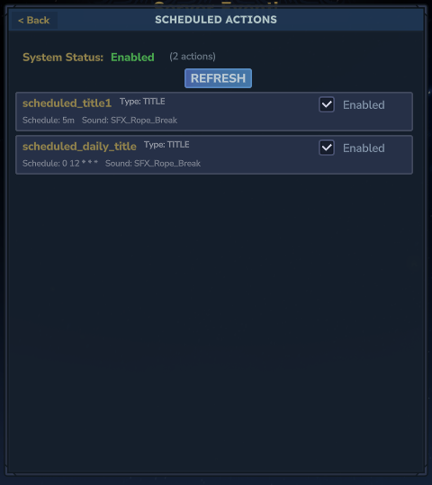

# GUI

HyAnnouncer includes an interactive web-based GUI for managing announcements. Access it with `/ha gui`.

The GUI provides:
- **Welcome Messages**: Toggle and configure welcome messages
- **Join/Leave Messages**: Configure join and leave announcements
- **Chat Announcements**: View, start/stop, and enable/disable individual announcements
- **Title Announcements**: View, start/stop, and enable/disable individual announcements
- **Notification Announcements**: View, start/stop, and enable/disable individual announcements
- **Scheduled Actions**: Manage cron-based and duration-based scheduled actions
- **Send Messages**: Manually send chat, title, or notification messages
- **Wiki**: View commands and placeholders

### GUI Screenshots

