# HyAnnouncer

**HyAnnouncer** is a powerful and flexible announcement system for Hytale servers with configurable intervals, multiple display types, world/permission filtering, clickable links, and comprehensive placeholder support.

[](https://www.curseforge.com/hytale/mods/hyannouncer)

:::warning Early Access Notice
Hytale is currently in early access, and this mod is also in early access. As the game evolves, things may change, break, or require updates. We're actively maintaining and improving the mod. If you encounter any issues or have suggestions, please reach out to us on [Discord](https://discord.gg/TCJAwsdqum) - we'd love to hear from you!
:::

## Features

- **Scheduled Announcements**: Automatically send announcements at configurable intervals
- **Cron-Based Scheduling**: Schedule announcements using cron expressions (e.g., `0 12 * * *` for daily at noon)
- **Simple Mode Scheduling**: Use duration strings (e.g., `10s`, `5m`, `1h`, `2d`) for easy interval-based scheduling
- **Sound System**: Play sounds with announcements (default sounds for title/notification, optional for chat)
- **Advanced Lag Protection**: Smart gap protection prevents announcement bursts during server lag
- **Announcement Modes**: 
  - **ROTATION Mode** - One global interval, rotate through announcements one at a time (recommended)
- **Multiple Display Types**: 
  - **Chat Announcements** - Messages in chat
  - **Title Announcements** - Center-screen titles (separate config)
  - **Notification Announcements** - Popup notifications (separate config)
- **Welcome Messages**: Customizable messages when players join (supports CHAT, TITLE, or BOTH) with clickable links
- **Join/Leave Messages**: Broadcast customized messages when players join or leave (supports CHAT, TITLE, or BOTH)
- **Join Scope Options**: Private messages (PLAYER) or server-wide broadcasts (SERVER)
- **Disable Default Join/Leave Messages**: Automatically disable default server join/leave messages
- **Clickable Links**: Add clickable URLs to announcements (Discord, websites, etc.)
- **World & Permission Filtering**: Target specific worlds or player permissions
- **Placeholders**: Dynamic placeholders for player names, world info, server stats, dates, and more
- **Color Codes**: Full Minecraft-style color code support (`&` and `§` symbols)
- **Hex Colors**: Support for `&#RRGGBB` and `{#RRGGBB}` formats
- **Multi-Color Messages**: Properly handles multiple colors in a single message
- **Prefix Support**: Global prefix for all announcements
- **Multi-Line Messages**: Each array element in `Lines` is a separate line
- **Priority System**: Order announcements by priority when not using random order
- **Require Players**: Option to only send announcements when players are online
- **Random or Sequential**: Choose announcement order
- **Debug Mode**: Detailed logging for troubleshooting
- **Manual Broadcast**: Trigger specific announcements on-demand with `/ha broadcast <id>`
- **GUI System**: Interactive web-based GUI for managing announcements (`/ha gui`)

## Installation

1. Download the latest version from [CurseForge](https://www.curseforge.com/hytale/mods/hyannouncer)
2. Place the JAR file in your server's `mods` folder
3. Start/restart your server
4. Configuration files will be created in `tins_HyAnnouncer/` directory
5. Edit config files and use `/ha reload` to apply changes

## Quick Start

The mod creates 7 configuration files:

- `config.json` - Debug settings
- `chat-announcements.json` - Scheduled chat announcements
- `title-announcements.json` - Scheduled center-screen title announcements
- `notify-announcements.json` - Scheduled notification popup announcements
- `welcome-message.json` - Welcome messages for joining players
- `join-leave-announcements.json` - Join/leave broadcasts
- `scheduled-actions.json` - Cron-based and duration-based scheduled actions

## GUI System

HyAnnouncer includes an interactive web-based GUI for managing announcements. Access it with `/ha gui`.

The GUI provides:
- **Welcome Messages**: Toggle and configure welcome messages
- **Join/Leave Messages**: Configure join and leave announcements
- **Chat Announcements**: View, start/stop, and enable/disable individual announcements
- **Title Announcements**: View, start/stop, and enable/disable individual announcements
- **Notification Announcements**: View, start/stop, and enable/disable individual announcements
- **Scheduled Actions**: Manage cron-based and duration-based scheduled actions
- **Send Messages**: Manually send chat, title, or notification messages
- **Wiki**: View commands and placeholders

### GUI Screenshots

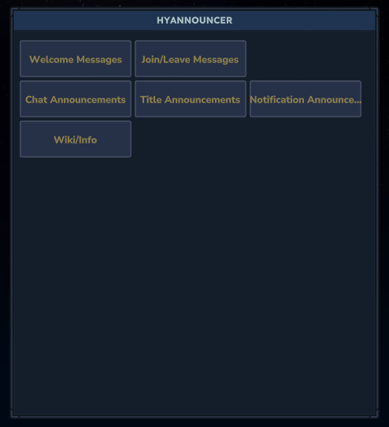

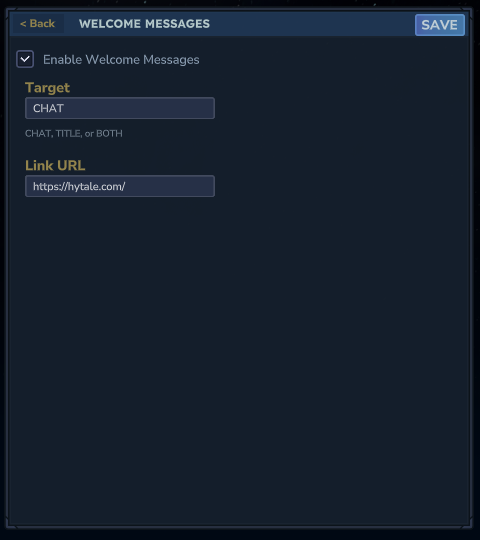

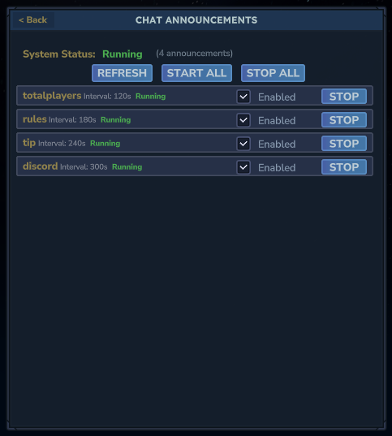

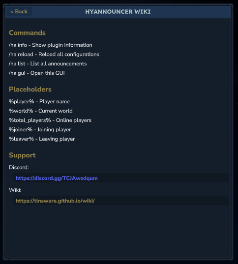

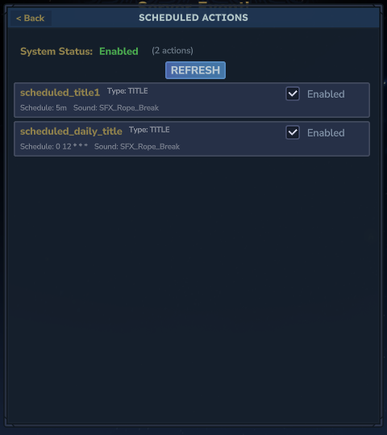

## Sound System

HyAnnouncer includes a comprehensive sound system that allows you to play audio effects alongside your announcements, enhancing the player experience with auditory feedback.

### How Sounds Work

- **Announcement Types**: Sounds are supported for **Title** and **Notification** announcements by default. Chat announcements can also play sounds if explicitly configured.
- **Sound Field**: Each announcement configuration includes a `Sound` field where you specify the sound name.
- **Default Sounds**: If no sound is specified, title and notification announcements use `SFX_Rope_Break` by default.
- **Empty Sounds**: Set the `Sound` field to an empty string `""` to disable sounds for chat announcements.
- **Sound Override**: Scheduled actions can override the announcement's sound if a different sound is specified in the action.

### In-Game Sound Testing

Players can test and preview sounds directly in-game through the HyAnnouncer GUI. This allows server administrators to easily find and select appropriate sounds for their announcements.

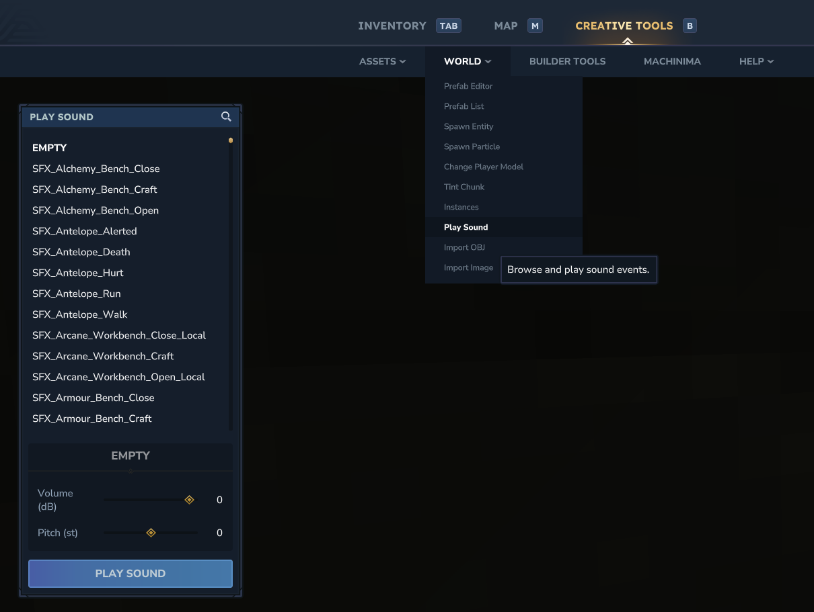

*The in-game sound interface allows players to browse and test all available sounds.*

### Complete Sound List

<details>
<summary>Click to expand the complete list of all 925 available sounds</summary>

#### Full Alphabetical Sound List
```
SFX_Alchemy_Bench_Close
SFX_Alchemy_Bench_Craft
SFX_Alchemy_Bench_Open
SFX_Antelope_Alerted
SFX_Antelope_Death
SFX_Antelope_Hurt
SFX_Antelope_Run
SFX_Antelope_Walk
SFX_Arcane_Workbench_Close_Local
SFX_Arcane_Workbench_Craft
SFX_Arcane_Workbench_Open_Local
SFX_Armour_Bench_Close
SFX_Armour_Bench_Craft
SFX_Armour_Bench_Open
SFX_Arrow_Fire_Hit
SFX_Arrow_Fire_Miss
SFX_Arrow_Frost_Hit
SFX_Arrow_Frost_Miss
SFX_Arrow_FullCharge_Hit
SFX_Arrow_FullCharge_Miss
SFX_Arrow_HalfCharge_Hit
SFX_Arrow_HalfCharge_Miss
SFX_Arrow_NoCharge_Hit
SFX_Arrow_NoCharge_Miss
SFX_Arrow_Whistle
SFX_Avatar_Powers_Disable
SFX_Avatar_Powers_Disable_Local
SFX_Avatar_Powers_Enable
SFX_Avatar_Powers_Enable_Local
SFX_Axe_Crude_Impact
SFX_Axe_Crude_Swing
SFX_Axe_Iron_Impact
SFX_Axe_Iron_Swing
SFX_Axe_Special_Impact
SFX_Axe_Special_Swing
SFX_Axe_Stone_Trork_Hit
SFX_Axe_Stone_Trork_Miss
SFX_Bat_Alerted
SFX_Bat_Death
SFX_Bat_Hurt
SFX_Battleaxe_T1_Block_Impact
SFX_Battleaxe_T1_Impact
SFX_Battleaxe_T1_Launch
SFX_Battleaxe_T1_Launch_Local
SFX_Battleaxe_T1_Raise
SFX_Battleaxe_T1_Raise_Local
SFX_Battleaxe_T1_Shove
SFX_Battleaxe_T1_Shove_Local
SFX_Battleaxe_T1_Swing
SFX_Battleaxe_T1_Swing_Charged
SFX_Battleaxe_T1_Swing_Charged_Local
SFX_Battleaxe_T1_Swing_Down_Local
SFX_Battleaxe_T1_Swing_LR_Local
SFX_Battleaxe_T1_Swing_RL_Local
SFX_Battleaxe_T2_Impact
SFX_Battleaxe_T2_Raise
SFX_Battleaxe_T2_Raise_Local
SFX_Battleaxe_T2_Signature_End
SFX_Battleaxe_T2_Signature_End_Local
SFX_Battleaxe_T2_Signature_Swing
SFX_Battleaxe_T2_Signature_Swing_Local
SFX_Battleaxe_T2_Swing
SFX_Battleaxe_T2_Swing_Charged
SFX_Battleaxe_T2_Swing_Charged_Local
SFX_Battleaxe_T2_Swing_Down_Local
SFX_Battleaxe_T2_Swing_LR_Local
SFX_Battleaxe_T2_Swing_RL_Local
SFX_Bear_Grizzly_Alerted
SFX_Bear_Grizzly_Attack
SFX_Bear_Grizzly_Death
SFX_Bear_Grizzly_Hurt
SFX_Bear_Grizzly_Run
SFX_Bear_Grizzly_Sleep
SFX_Bear_Walk
SFX_Bench_Placeholder
SFX_Bison_Alerted
SFX_Bison_Death
SFX_Bison_Hurt
SFX_Bison_Idle
SFX_Bison_Run
SFX_Bison_Walk
SFX_Blunderbuss_Bullet_WhizBy
SFX_Blunderbuss_Fire
SFX_Blunderbuss_Fire_Local
SFX_Blunderbuss_Hit
SFX_Blunderbuss_Load
SFX_Blunderbuss_Load_Local
SFX_Blunderbuss_Miss
SFX_Blunderbuss_No_Ammo
SFX_Boar_Alerted
SFX_Boar_Death
SFX_Boar_Hurt
SFX_Boar_Run
SFX_Boar_Sleep
SFX_Boar_Walk
SFX_Bomb_Fire_Goblin_Bounce
SFX_Bomb_Fire_Goblin_Death
SFX_Bomb_Fire_Goblin_Hit
SFX_Bomb_Fire_Goblin_Miss
SFX_Bomb_Fuse
SFX_Bow_No_Ammo
SFX_Bow_T1_Block_Impact
SFX_Bow_T1_Draw
SFX_Bow_T1_Draw_Local
SFX_Bow_T1_Raise
SFX_Bow_T1_Raise_Local
SFX_Bow_T1_Shoot
SFX_Bow_T1_Shoot_Local
SFX_Bow_T1_Swing
SFX_Bow_T1_Swing_Local
SFX_Bow_T2_Draw
SFX_Bow_T2_Draw_Local
SFX_Bow_T2_Shoot
SFX_Bow_T2_Shoot_Local
SFX_Bow_T2_Signature_Loop
SFX_Bow_T2_Signature_Loop_Local
SFX_Bow_T2_Signature_Nock
SFX_Bow_T2_Signature_Nock_Local
SFX_Bow_T2_Signature_Shoot
SFX_Bow_T2_Signature_Shoot_Local
SFX_Bunny_Alerted
SFX_Bunny_Death
SFX_Bunny_Hurt
SFX_Calf_Hurt
SFX_Calf_Run
SFX_Calf_Walk
SFX_Camel_Alerted
SFX_Camel_Death
SFX_Camel_Hurt
SFX_Camel_Laydown
SFX_Camel_Run
SFX_Camel_Sleep
SFX_Camel_Wake
SFX_Camel_Walk
SFX_Campfire_Close_Local
SFX_Campfire_Open_Local
SFX_Campfire_Processing
SFX_Campfire_Processing_End
SFX_Campfire_Processing_Failed
SFX_Capture_Crate_Capture_Fail_Local
SFX_Capture_Crate_Capture_Succeed
SFX_Capture_Crate_Capture_Succeed_Local
SFX_Capture_Crate_Spawn_Fail_Local
SFX_Capture_Crate_Spawn_Succeed
SFX_Chest_Legendary_Close_Player
SFX_Chest_Legendary_FirstOpen_Player
SFX_Chest_Legendary_Loop
SFX_Chest_Legendary_Open
SFX_Chest_Wooden_Close
SFX_Chest_Wooden_Open
SFX_Chest_Wooden_Open_Player
SFX_Chick_Alerted
SFX_Chick_Death
SFX_Chick_Hurt
SFX_Chicken_Alerted
SFX_Chicken_Death
SFX_Chicken_Flee
SFX_Chicken_Hurt
SFX_Chicken_Run
SFX_Chicken_Walk
SFX_Club_Meat_Impact
SFX_Club_Meat_Swing
SFX_Club_Special_Impact
SFX_Club_Special_Swing
SFX_Club_Steel_Impact
SFX_Club_Steel_Swing
SFX_Club_Wood_Impact
SFX_Club_Wood_Swing
SFX_Consume_Bread
SFX_Consume_Bread_Local
SFX_Cow_Alerted
SFX_Cow_Death
SFX_Cow_Hurt
SFX_Cow_Idle
SFX_Cow_Run
SFX_Cow_Sleep
SFX_Cow_Walk
SFX_Crawler_Void_Alerted
SFX_Crawler_Void_Alerted_02
SFX_Crawler_Void_Death
SFX_Crawler_Void_Despawn
SFX_Crawler_Void_Hurt
SFX_Crawler_Void_Run
SFX_Crawler_Void_Sleep
SFX_Crawler_Void_Spawn
SFX_Crawler_Void_Spawn_02
SFX_Crawler_Void_Walk
SFX_Creative_Play_Add_Mask
SFX_Creative_Play_Brush_Erase
SFX_Creative_Play_Brush_Mode
SFX_Creative_Play_Brush_Paint_Base
SFX_Creative_Play_Brush_Paint_Idle_Layer
SFX_Creative_Play_Brush_Paint_Move_Layer
SFX_Creative_Play_Brush_Shape
SFX_Creative_Play_Brush_Stamp
SFX_Creative_Play_Error
SFX_Creative_Play_Eyedropper_Select
SFX_Creative_Play_Paste
SFX_Creative_Play_Selection_Drag
SFX_Creative_Play_Selection_Place
SFX_Creative_Play_Selection_Scale
SFX_Creative_Play_Selection_Widget
SFX_Creative_Play_Set_Mask
SFX_Crocodile_Alerted
SFX_Crocodile_Death
SFX_Crocodile_Hurt
SFX_Crow_Death
SFX_Crow_Hurt
SFX_Daggers_T1_Guard
SFX_Daggers_T1_Guard_Local
SFX_Daggers_T1_Pounce
SFX_Daggers_T1_Pounce_Local
SFX_Daggers_T1_Slash_Impact
SFX_Daggers_T1_Stab_Double_Impact
SFX_Daggers_T1_Stab_Impact
SFX_Daggers_T1_Stab_Left_Local
SFX_Daggers_T1_Stab_Retreat
SFX_Daggers_T1_Stab_Retreat_Local
SFX_Daggers_T1_Stab_Right_Local
SFX_Daggers_T1_Swing
SFX_Daggers_T1_Swing_Double
SFX_Daggers_T1_Swing_Double_Local
SFX_Daggers_T1_Swing_LR_Local
SFX_Daggers_T1_Swing_RL_Local
SFX_Daggers_T2_Guard
SFX_Daggers_T2_Guard_Local
SFX_Daggers_T2_Signature_P1
SFX_Daggers_T2_Signature_P1_Local
SFX_Daggers_T2_Signature_P2
SFX_Daggers_T2_Signature_P2_Local
SFX_Daggers_T2_Signature_P3
SFX_Daggers_T2_Signature_P3_Local
SFX_Daggers_T2_Slash_Impact
SFX_Daggers_T2_Stab_Double_Impact
SFX_Daggers_T2_Stab_Impact
SFX_Daggers_T2_Stab_Left_Local
SFX_Daggers_T2_Stab_Retreat
SFX_Daggers_T2_Stab_Retreat_Local
SFX_Daggers_T2_Stab_Right_Local
SFX_Daggers_T2_Swing
SFX_Daggers_T2_Swing_Double
SFX_Daggers_T2_Swing_Double_Local
SFX_Daggers_T2_Swing_LR_Local
SFX_Daggers_T2_Swing_RL_Local
SFX_Deer_Doe_Alerted
SFX_Deer_Doe_Death
SFX_Deer_Doe_Hurt
SFX_Deer_Doe_Run
SFX_Deer_Doe_Sleep
SFX_Deer_Stag_Alerted
SFX_Deer_Stag_Death
SFX_Deer_Stag_Hurt
SFX_Deer_Stag_Roar
SFX_Deer_Stag_Run
SFX_Deer_Stag_Sleep
SFX_Deer_Walk
SFX_Deployable_Totem_Heal_Despawn
SFX_Deployable_Totem_Heal_Effect_Local
SFX_Deployable_Totem_Heal_Spawn
SFX_Deployable_Totem_Slowing_Despawn
SFX_Deployable_Totem_Slowing_Effect_Local
SFX_Deployable_Totem_Slowing_Spawn
SFX_Discovery_Z1_Medium
SFX_Discovery_Z1_Short
SFX_Discovery_Z2_Medium
SFX_Discovery_Z2_Short
SFX_Discovery_Z3_Medium
SFX_Discovery_Z3_Short
SFX_Discovery_Z4_Medium
SFX_Discovery_Z4_Short
SFX_Divine_Respawn
SFX_Door_Ancient_Close
SFX_Door_Ancient_Open
SFX_Door_Crude_Close
SFX_Door_Crude_Open
SFX_Door_Desert_Close
SFX_Door_Desert_Open
SFX_Door_Jungle_Close
SFX_Door_Jungle_Open
SFX_Door_Lumberjack_Close
SFX_Door_Lumberjack_Open
SFX_Door_Temple_Dark_Close
SFX_Door_Temple_Dark_Open
SFX_Door_Temple_Light_Close
SFX_Door_Temple_Light_Open
SFX_Door_Wooden_Close
SFX_Door_Wooden_Open
SFX_Drag_Armor_Cloth
SFX_Drag_Armor_Heavy
SFX_Drag_Armor_Leather
SFX_Drag_Blocks_Gravel
SFX_Drag_Blocks_Soft
SFX_Drag_Blocks_Splatty
SFX_Drag_Blocks_Stone
SFX_Drag_Blocks_Wood
SFX_Drag_Item_Default
SFX_Drag_Items_Bones
SFX_Drag_Items_Chest
SFX_Drag_Items_Clay
SFX_Drag_Items_Cloth
SFX_Drag_Items_Foliage
SFX_Drag_Items_Gadget
SFX_Drag_Items_Gems
SFX_Drag_Items_Ingots
SFX_Drag_Items_Leather
SFX_Drag_Items_Metal
SFX_Drag_Items_Paper
SFX_Drag_Items_Potion
SFX_Drag_Items_Seeds
SFX_Drag_Items_Shells
SFX_Drag_Items_Splatty
SFX_Drag_Weapon_Blade_Small
SFX_Drag_Weapon_Blunt_Large
SFX_Drag_Weapons_Arrows
SFX_Drag_Weapons_Blade_Large
SFX_Drag_Weapons_Blunt_Small
SFX_Drag_Weapons_Books
SFX_Drag_Weapons_Shield_Metal
SFX_Drag_Weapons_Shield_Wood
SFX_Drag_Weapons_Stone_Large
SFX_Drag_Weapons_Stone_Small
SFX_Drag_Weapons_Wand
SFX_Drag_Weapons_Wood
SFX_Dragon_Sleep
SFX_Drop_Armor_Cloth
SFX_Drop_Armor_Heavy
SFX_Drop_Armor_Leather
SFX_Drop_Blocks_Gravel
SFX_Drop_Blocks_Soft
SFX_Drop_Blocks_Splatty
SFX_Drop_Blocks_Stone
SFX_Drop_Blocks_Wood
SFX_Drop_Item_Default
SFX_Drop_Items_Bones
SFX_Drop_Items_Chest
SFX_Drop_Items_Clay
SFX_Drop_Items_Cloth
SFX_Drop_Items_Foliage
SFX_Drop_Items_Gadget
SFX_Drop_Items_Gems
SFX_Drop_Items_Ingots
SFX_Drop_Items_Leather
SFX_Drop_Items_Metal
SFX_Drop_Items_Paper
SFX_Drop_Items_Potion
SFX_Drop_Items_Seeds
SFX_Drop_Items_Shells
SFX_Drop_Items_Splatty
SFX_Drop_Weapon_Blade_Small
SFX_Drop_Weapon_Blade_Large
SFX_Drop_Weapons_Arrows
SFX_Drop_Weapons_Blunt_Large
SFX_Drop_Weapons_Blunt_Small
SFX_Drop_Weapons_Books
SFX_Drop_Weapons_Shield_Metal
SFX_Drop_Weapons_Shield_Wood
SFX_Drop_Weapons_Stone_Large
SFX_Drop_Weapons_Stone_Small
SFX_Drop_Weapons_Wand
SFX_Drop_Weapons_Wood
SFX_Duck_Alerted
SFX_Duck_Death
SFX_Duck_Hurt
SFX_Duck_Run
SFX_Effect_Burn_Local
SFX_Effect_Burn_World
SFX_Effect_Poison_Local
SFX_Effect_Poison_World
SFX_Egg_Hit
SFX_Egg_Miss
SFX_Emberwulf_Alerted
SFX_Emberwulf_Attack_Bite
SFX_Emberwulf_Death
SFX_Emberwulf_Hurt
SFX_Emberwulf_Run
SFX_Emberwulf_Sleep
SFX_Emberwulf_Walk
SFX_Eye_Void_Alerted
SFX_Eye_Void_Attack_Blast
SFX_Eye_Void_Attack_Summon
SFX_Eye_Void_Death
SFX_Eye_Void_Fly_Movement
SFX_Eye_Void_Hurt
SFX_Eye_Void_Idle
SFX_Fen_Stalker_Alerted
SFX_Fen_Stalker_Attack_Swing
SFX_Fen_Stalker_Attack_Swipe
SFX_Fen_Stalker_Death
SFX_Fen_Stalker_Eat
SFX_Fen_Stalker_Eat_Finish
SFX_Fen_Stalker_Greet
SFX_Fen_Stalker_Hurt
SFX_Fen_Stalker_Run
SFX_Fen_Stalker_Scared
SFX_Fen_Stalker_Seek
SFX_Fen_Stalker_Sniff
SFX_Feran_Death
SFX_Fireball_Bounce
SFX_Fireball_Death
SFX_Fireball_Miss
SFX_Fish_Death
SFX_Fish_Flee
SFX_Fish_Hurt
SFX_Flail_Charge
SFX_Flail_Charge_Local
SFX_Flail_Swing
SFX_Flail_Swing_Left_Local
SFX_Flail_Swing_Right_Local
SFX_Flamingo_Alerted
SFX_Flamingo_Death
SFX_Flamingo_Fly
SFX_Flamingo_Hurt
SFX_Fox_Alerted
SFX_Fox_Death
SFX_Fox_Hurt
SFX_Fox_Run
SFX_Fox_Sleep
SFX_Frog_Alerted
SFX_Frog_Croak
SFX_Frog_Death
SFX_Frog_Hurt
SFX_Frog_Idle
SFX_Frog_Run
SFX_Furnace_Bench_Close
SFX_Furnace_Bench_Open
SFX_Furnace_Bench_Processing
SFX_Furnace_Bench_Processing_Complete
SFX_Furnace_Bench_Processing_End
SFX_Furnace_Bench_Processing_Failed
SFX_Gecko_Alerted
SFX_Gecko_Death
SFX_Gecko_Hurt
SFX_Generic_Crafting_Failed
SFX_Goat_Run
SFX_Goat_Walk
SFX_Goblin_Alerted
SFX_Goblin_Death
SFX_Goblin_Hurt
SFX_Goblin_Lobber_Bomb_Bounce
SFX_Goblin_Lobber_Bomb_Death
SFX_Goblin_Lobber_Bomb_Hit
SFX_Goblin_Lobber_Bomb_Miss
SFX_Goblin_Run
SFX_Goblin_Search
SFX_Golem_Earth_Alerted
SFX_Golem_Earth_Death
SFX_Golem_Earth_Hurt
SFX_Golem_Earth_Laydown
SFX_Golem_Earth_Slam
SFX_Golem_Earth_Slam_Impact
SFX_Golem_Earth_Spin
SFX_Golem_Earth_Stomp
SFX_Golem_Earth_Stomp_Impact
SFX_Golem_Earth_Swing
SFX_Golem_Earth_Swing_Impact
SFX_Golem_Earth_Wake
SFX_Golem_Firesteel_Alerted_01
SFX_Golem_Firesteel_Alerted_02
SFX_Golem_Firesteel_Death
SFX_Golem_Firesteel_Laydown
SFX_Golem_Firesteel_Wake
SFX_Golem_Frost_Alerted
SFX_Golem_Frost_Death
SFX_Golem_Frost_Hurt
SFX_Golem_Frost_Laydown
SFX_Golem_Frost_Slam
SFX_Golem_Frost_Slam_Impact
SFX_Golem_Frost_Spin
SFX_Golem_Frost_Stomp
SFX_Golem_Frost_Swing
SFX_Golem_Frost_Swing_Impact
SFX_Golem_Frost_Wake
SFX_Golem_Sand_Alerted
SFX_Golem_Sand_Death
SFX_Golem_Sand_Hurt
SFX_Golem_Sand_Laydown
SFX_Golem_Sand_Slam
SFX_Golem_Sand_Slam_Impact
SFX_Golem_Sand_Spin
SFX_Golem_Sand_Stomp
SFX_Golem_Sand_Stomp_Impact
SFX_Golem_Sand_Swing
SFX_Golem_Sand_Swing_Impact
SFX_Golem_Sand_Wake
SFX_Gun_Fire
SFX_GunPvP_Assault_Rifle_Bullet_Death
SFX_GunPvP_Grenade_Frag_Bounce
SFX_GunPvP_Grenade_Frag_Death
SFX_GunPvP_Grenade_Frag_Hit
SFX_GunPvP_Grenade_Frag_Miss
SFX_GunPvP_Handgun_Bullet_Death
SFX_Hand_Crossbow_T1_Block_Impact
SFX_Hand_Crossbow_T1_Raise
SFX_Hand_Crossbow_T1_Raise_Local
SFX_Hand_Crossbow_T1_Shove
SFX_Hand_Crossbow_T1_Shove_Local
SFX_Hand_Crossbow_T2_Load
SFX_Hand_Crossbow_T2_Load_Local
SFX_Hand_Crossbow_T2_Reload_Start
SFX_Hand_Crossbow_T2_Reload_Start_Local
SFX_Handgun_Fire
SFX_Handgun_Fire_Local
SFX_Hatchet_T1_Swing_RL_Local
SFX_Hatchet_T2_Impact_Nice
SFX_Health_Potion_High_Drink
SFX_Health_Potion_High_Drink_Local
SFX_Health_Potion_Low_Drink
SFX_Health_Potion_Low_Drink_Local
SFX_Hedera_Scream
SFX_Hoe_T1_Swing_Down_Local
SFX_Hoe_T1_Till
SFX_Horse_Alerted
SFX_Horse_Death
SFX_Horse_Hurt
SFX_Horse_Idle
SFX_Horse_Run
SFX_Horse_Sleep
SFX_Horse_Wake
SFX_Hyena_Alerted
SFX_Hyena_Death
SFX_Hyena_Hurt
SFX_Hyena_Idle
SFX_Ice_Ball_Death
SFX_Ice_Bolt_Death
SFX_Ice_Item_Impact
SFX_Ice_Item_Swing
SFX_Incorrect_Tool
SFX_Item_Break
SFX_Item_Repair
SFX_Klops_Alerted
SFX_Klops_Death
SFX_Klops_Hurt
SFX_Klops_Idle
SFX_Klops_Run
SFX_Kweebec_Plushie_Impact
SFX_Lamb_Alerted
SFX_Lamb_Death
SFX_Lamb_Hurt
SFX_Larva_Alerted
SFX_Larva_Death
SFX_Larva_Despawn
SFX_Larva_Hurt
SFX_Larva_Spawn
SFX_Leopard_Snow_Alerted
SFX_Leopard_Snow_Death
SFX_Leopard_Snow_Hurt
SFX_Leopard_Snow_Run
SFX_Light_Melee_T1_Block
SFX_Light_Melee_T1_Guard_Hit
SFX_Light_Melee_T1_Impact
SFX_Light_Melee_T1_Lunge
SFX_Light_Melee_T1_Lunge_Charge
SFX_Light_Melee_T1_Shove
SFX_Light_Melee_T1_Swing
SFX_Light_Melee_T2_Block
SFX_Light_Melee_T2_Guard_Break
SFX_Light_Melee_T2_Guard_Hit
SFX_Light_Melee_T2_Lunge
SFX_Light_Melee_T2_Lunge_Charge
SFX_Light_Melee_T2_Swing
SFX_Longsword_Special_Impact
SFX_Longsword_Special_Swing
SFX_Longsword_Steel_Charged_Swing
SFX_Longsword_Steel_Impact
SFX_Longsword_Steel_Swing
SFX_Lumbermill_Bench_Close
SFX_Lumbermill_Bench_Open
SFX_Lumbermill_Bench_Processing
SFX_Mace_T1_Block_Impact
SFX_Mace_T1_Impact
SFX_Mace_T1_Raise
SFX_Mace_T1_Raise_Local
SFX_Mace_T1_Shove
SFX_Mace_T1_Shove_Local
SFX_Mace_T1_Swing
SFX_Mace_T1_Swing_Charged
SFX_Mace_T1_Swing_Charged_LR_Local
SFX_Mace_T1_Swing_Charged_RL_Local
SFX_Mace_T1_Swing_Charged_Up_Local
SFX_Mace_T1_Swing_LR_Local
SFX_Mace_T1_Swing_RL_Local
SFX_Mace_T1_Swing_Up_Local
SFX_Mace_T2_Impact
SFX_Mace_T2_Raise
SFX_Mace_T2_Raise_Local
SFX_Mace_T2_Signature_Impact
SFX_Mace_T2_Signature_Impact_Local
SFX_Mace_T2_Signature_Launch
SFX_Mace_T2_Signature_Launch_Local
SFX_Mace_T2_Swing
SFX_Mace_T2_Swing_Charged
SFX_Mace_T2_Swing_Charged_LR_Local
SFX_Mace_T2_Swing_Charged_RL_Local
SFX_Mace_T2_Swing_Charged_Up_Local
SFX_Mace_T2_Swing_LR_Local
SFX_Mace_T2_Swing_RL_Local
SFX_Mace_T2_Swing_Up_Local
SFX_Meerkat_Alerted
SFX_Meerkat_Death
SFX_Meerkat_Hurt
SFX_Meerkat_Idle
SFX_Memories_Unlock_Local
SFX_Moose_Bull_Alerted
SFX_Mouse_Alerted
SFX_Mouse_Death
SFX_Mouse_Flee
SFX_Mouse_Hurt
SFX_Mouse_Run
SFX_Mouse_Sleep
SFX_Mug_Fill
SFX_Mug_Fill_Local
SFX_Music_Ducking_2db
SFX_NPC_Unarmed_Impact
SFX_NPC_Unarmed_Swing
SFX_Outlander_Hunter_Arrow_Hit
SFX_Outlander_Hunter_Arrow_Miss
SFX_Outlander_Hunter_Hurt
SFX_Owl_Alerted
SFX_Owl_Death
SFX_Owl_Hurt
SFX_Pickaxe_T1_Swing_Down_Local
SFX_Pickaxe_T2_Impact_Nice
SFX_Pig_Alerted
SFX_Pig_Death
SFX_Pig_Hurt
SFX_Pig_Run
SFX_Pig_Walk
SFX_Pigeon_Death
SFX_Pigeon_Hurt
SFX_Piglet_Alerted
SFX_Piglet_Death
SFX_Piglet_Hurt
SFX_Piglet_Run
SFX_Pistol_Fire
SFX_Player_Climb_Down
SFX_Player_Climb_Side
SFX_Player_Climb_Up
SFX_Player_Craft_Item_Inventory
SFX_Player_Death
SFX_Player_Death_Drown
SFX_Player_Death_Fall
SFX_Player_Drop_Item
SFX_Player_Fall
SFX_Player_Glide_Motion
SFX_Player_Glide_Stationary
SFX_Player_Grab_Item
SFX_Player_Hurt
SFX_Player_Hurt_Burn
SFX_Player_Hurt_Drowning
SFX_Player_Hurt_Fall
SFX_Player_Jump
SFX_Player_Mantle
SFX_Player_Pickup_Item
SFX_Player_Roll
SFX_Player_Slide
SFX_Player_Swim
SFX_Player_Swim_Fast
SFX_Player_Swim_Jump
SFX_Player_Unarmed_Swing_Left
SFX_Player_Unarmed_Swing_Right
SFX_Poop_Bounce
SFX_Portal_Neutral
SFX_Portal_Neutral_Open
SFX_Portal_Neutral_Teleport_Local
SFX_Portal_Void
SFX_Potion_Drink_Success
SFX_Processing_Placeholder
SFX_Projectile_Poop_Hit
SFX_Rabbit_Alerted
SFX_Rabbit_Death
SFX_Rabbit_Hurt
SFX_Rabbit_Run
SFX_Rabbit_Sleep
SFX_Ram_Alerted
SFX_Ram_Death
SFX_Ram_Hurt
SFX_Ram_Run
SFX_Ram_Sleep
SFX_Raptor_Cave_Alerted
SFX_Raptor_Cave_Idle
SFX_Rat_Death
SFX_Rat_Hurt
SFX_Raven_Alerted
SFX_Raven_Death
SFX_Raven_Flee
SFX_Raven_Hurt
SFX_Rifle_Fire
SFX_Rifle_Fire_Local
SFX_Rotate_Pitch_Default
SFX_Rotate_Roll_Default
SFX_Rotate_Yaw_Default
SFX_Rubble_Bounce
SFX_Rubble_Hit
SFX_Scarak_Fighter_Alerted
SFX_Scarak_Fighter_Death
SFX_Scarak_Fighter_Hurt
SFX_Scarak_Seeker_Alerted
SFX_Scarak_Seeker_Death
SFX_Scarak_Seeker_Hurt
SFX_Scarak_Seeker_Spitball_Death
SFX_Scarak_Spitball_Fire
SFX_Scorpion_Alerted
SFX_Scorpion_Death
SFX_Scorpion_Run
SFX_Scorpion_Threaten
SFX_Shark_Death
SFX_Shark_Dive
SFX_Shark_Hurt
SFX_Shark_Swim
SFX_Shears_Activate
SFX_Sheep_Alerted
SFX_Sheep_Death
SFX_Sheep_Hurt
SFX_Sheep_Run
SFX_Sheep_Sheared
SFX_Sheep_Walk
SFX_Shield_T1_Break
SFX_Shield_T1_Impact
SFX_Shield_T1_Raise
SFX_Shield_T1_Raise_Local
SFX_Shield_T1_Swing
SFX_Shield_T1_Swing_Local
SFX_Shield_T2_Impact
SFX_Shield_T2_Raise
SFX_Shield_T2_Raise_Local
SFX_Shield_T2_Swing
SFX_Shield_T2_Swing_Local
SFX_Shovel_T1_Swing_RL_Local
SFX_Shovel_T2_Impact_Nice
SFX_Skeleton_Alerted
SFX_Skeleton_Death_1
SFX_Skeleton_Death_2
SFX_Skeleton_Death_3
SFX_Skeleton_Death_4
SFX_Skeleton_Despawn_1
SFX_Skeleton_Despawn_2
SFX_Skeleton_Hurt
SFX_Skeleton_Mage_Spellbook_Charge
SFX_Skeleton_Mage_Spellbook_Impact
SFX_Skeleton_Praetorian_Alerted
SFX_Skeleton_Praetorian_Death_1
SFX_Skeleton_Praetorian_Death_2
SFX_Skeleton_Praetorian_Death_3
SFX_Skeleton_Praetorian_Death_4
SFX_Skeleton_Praetorian_Despawn_1
SFX_Skeleton_Praetorian_Despawn_2
SFX_Skeleton_Praetorian_Hurt
SFX_Skeleton_Praetorian_Run
SFX_Skeleton_Praetorian_Search_2
SFX_Skeleton_Praetorian_Spawn_1
SFX_Skeleton_Praetorian_Walk
SFX_Skeleton_Run
SFX_Skeleton_Search_2
SFX_Skeleton_Spawn_1
SFX_Skeleton_Spawn_2
SFX_Skeleton_Walk
SFX_Snake_Alerted
SFX_Snake_Death
SFX_Snake_Hurt
SFX_Snake_Idle
SFX_Spark_Living_Alerted
SFX_Spark_Living_Death
SFX_Sparrow_Alerted
SFX_Sparrow_Death
SFX_Sparrow_Hurt
SFX_Sparrow_Idle
SFX_Spawn_Void_Alerted
SFX_Spawn_Void_Attack
SFX_Spawn_Void_Death
SFX_Spawn_Void_Hurt
SFX_Spawn_Void_Run
SFX_Spear_Impact
SFX_Spear_Lunge
SFX_Spear_Lunge_Local
SFX_Spear_Miss
SFX_Spear_Projectile_Impact
SFX_Spear_Throw
SFX_Spear_Throw_Charge
SFX_Spear_Throw_Charge_Local
SFX_Spear_Throw_Local
SFX_Spider_Alerted
SFX_Spider_Death
SFX_Spider_Run
SFX_Spirit_Root_Alerted
SFX_Spirit_Root_Death_01
SFX_Spirit_Root_Death_02
SFX_Spirit_Root_Hurt
SFX_Spirit_Root_Spawn
SFX_Squirrel_Alerted
SFX_Squirrel_Death
SFX_Squirrel_Hurt
SFX_Squirrel_Run
SFX_Staff_Charged_Loop
SFX_Staff_Fire_Shoot
SFX_Staff_Flame_Consume_Charge_1
SFX_Staff_Flame_Consume_Charge_1_Local
SFX_Staff_Flame_Consume_Charge_2
SFX_Staff_Flame_Consume_Charge_2_Local
SFX_Staff_Flame_Consume_Charge_3
SFX_Staff_Flame_Consume_Charge_3_Local
SFX_Staff_Flame_Consume_Charge_4
SFX_Staff_Flame_Consume_Charge_4_Local
SFX_Staff_Flame_Fireball_Impact
SFX_Staff_Flame_Fireball_Launch
SFX_Staff_Flame_Fireball_Launch_Local
SFX_Staff_Flame_Flamethrower
SFX_Staff_Flame_Flamethrower_End
SFX_Staff_Flame_Flamethrower_End_Local
SFX_Staff_Flame_Flamethrower_Impact
SFX_Staff_Flame_Flamethrower_Local
SFX_Staff_Flame_Trap_Deploy
SFX_Staff_Flame_Trap_Despawn
SFX_Staff_Flame_Trap_Loop
SFX_Staff_Ice_Shoot
SFX_Stamina_Potion_Success
SFX_Stone_Coffin_Open_Close
SFX_Sword_T1_Block_Local
SFX_Sword_T1_Lunge_Charge_Local
SFX_Sword_T1_Lunge_Local
SFX_Sword_T1_Shove_Local
SFX_Sword_T1_Swing_Down_Local
SFX_Sword_T1_Swing_LR_Local
SFX_Sword_T1_Swing_RL_Local
SFX_Sword_T2_Block_Local
SFX_Sword_T2_Impact
SFX_Sword_T2_Lunge_Charge_Local
SFX_Sword_T2_Lunge_Local
SFX_Sword_T2_Signature_Part_1
SFX_Sword_T2_Signature_Part_1_Local
SFX_Sword_T2_Signature_Part_2
SFX_Sword_T2_Signature_Part_2_Local
SFX_Sword_T2_Swing_Down_Local
SFX_Sword_T2_Swing_LR_Local
SFX_Sword_T2_Swing_RL_Local
SFX_T1_Impact_Blunt
SFX_Test_Blip_A
SFX_Test_Blip_B
SFX_Test_Blip_C
SFX_Tetrabird_Alerted
SFX_Tetrabird_Death
SFX_Tetrabird_Flee
SFX_Tetrabird_Hurt
SFX_Tetrabird_Run
SFX_Tiger_Sabertooth_Alerted
SFX_Tiger_Sabertooth_Death
SFX_Tiger_Sabertooth_Hurt
SFX_Tiger_Sabertooth_Run
SFX_Toad_Rhino_Alerted
SFX_Toad_Rhino_Death
SFX_Toad_Rhino_Hurt
SFX_Toad_Rhino_Magma_Alerted
SFX_Toad_Rhino_Magma_Death
SFX_Toad_Rhino_Magma_Hurt
SFX_Toad_Rhino_Magma_Run
SFX_Toad_Rhino_Magma_Tongue_Impact
SFX_Toad_Rhino_Magma_Tongue_Whoosh
SFX_Toad_Rhino_Run
SFX_Toad_Rhino_Tongue_Impact
SFX_Toad_Rhino_Tongue_Whoosh
SFX_Tool_T1_Swing
SFX_Torch_Impact
SFX_Torch_Swing
SFX_Torch_Swing_Left_Local
SFX_Torch_Swing_Right_Local
SFX_Tornado
SFX_Trork_Alerted
SFX_Trork_Chieftain_Alerted
SFX_Trork_Chieftain_Death
SFX_Trork_Chieftain_Hurt
SFX_Trork_Chieftain_Run
SFX_Trork_Chieftain_Search
SFX_Trork_Death
SFX_Trork_Exertion
SFX_Trork_Hurt_01
SFX_Trork_Hurt_02
SFX_Trork_Run
SFX_Trork_Search
SFX_Trork_Sleep
SFX_Trork_Throwing_Axe
SFX_Unarmed_Impact
SFX_Unarmed_Swing
SFX_Vulture_Alerted
SFX_Vulture_Death
SFX_Vulture_Flee
SFX_Vulture_Hurt
SFX_Wand_Fire_Shoot
SFX_Wand_Ice_Shoot
SFX_Warthog_Alerted
SFX_Warthog_Death
SFX_Warthog_Hurt
SFX_Warthog_Piglet_Alerted
SFX_Warthog_Piglet_Death
SFX_Warthog_Piglet_Hurt
SFX_Warthog_Piglet_Run
SFX_Warthog_Run
SFX_Warthog_Sleep
SFX_Warthog_Walk
SFX_Weapon_Bench_Close
SFX_Weapon_Bench_Craft
SFX_Weapon_Bench_Open
SFX_Weapon_Charge_Swing
SFX_Wolf_Alerted
SFX_Wolf_Death
SFX_Wolf_Hurt
SFX_Wolf_Run
SFX_Wolf_Sleep
SFX_Woodpecker_Death
SFX_Woodpecker_Hurt
SFX_Workbench_Close
SFX_Workbench_Craft
SFX_Workbench_Open
SFX_Workbench_Upgrade_Complete_Default
SFX_Workbench_Upgrade_Start_Default
SFX_Yeti_Alerted
SFX_Zombie_Alerted
SFX_Zombie_Attack_Bite
SFX_Zombie_Attack_Swing
SFX_Zombie_Death
SFX_Zombie_Despawn
SFX_Zombie_Hurt
SFX_Zombie_Pursuit
SFX_Zombie_ScratchBack
SFX_Zombie_Spawn
```
</details>

## Commands

All commands require OP permissions:

| Command | Description |
|---------|-------------|
| `/ha` or `/hyannouncer` or `/announce` | Main command (shows help) |
| `/ha info` | Show mod information, version, and Discord link |
| `/ha reload` | Reload all configuration files and restart announcements with new settings (no server restart required) |
| `/ha test` | Test all announcements immediately |
| `/ha broadcast <id>` or `/ha bc <id>` | Manually trigger a specific announcement |
| `/ha list` or `/ha ls` or `/ha status` | List all available announcements with details |
| `/ha gui` | Open the interactive GUI for managing announcements |

### Command Examples

#### Main Command Help

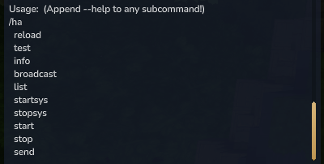

#### Info Command

**Command:** `/ha info`

Displays mod information including version, active announcements count, and Discord link.

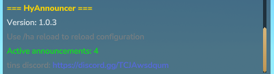

#### List Command

**Command:** `/ha list` or `/ha ls` or `/ha status`

Lists all configured announcements with their details.

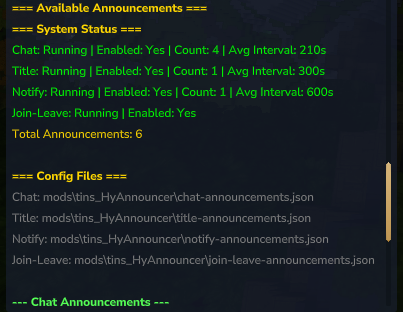

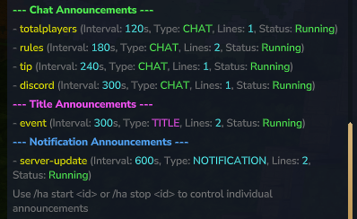

#### Reload Command

**Command:** `/ha reload`

Reloads all configuration files and restarts announcements with new settings.

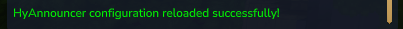

#### Test Command

**Command:** `/ha test`

Immediately sends all enabled announcements to all online players.

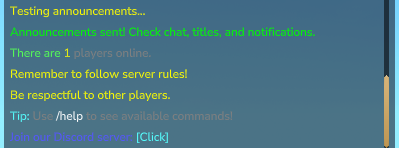

.png)

#### System Control Commands

**Commands:** `/ha startsys` and `/ha stopsys`

Control announcement systems. When run without arguments, shows the status of all systems.

.png)

### System Control Commands

| Command | Description |
|---------|-------------|
| `/ha startsys [chat\|title\|notify\|joinleave\|all]` | Start specific announcement systems |
| `/ha stopsys [chat\|title\|notify\|joinleave\|all]` | Stop specific announcement systems |
| `/ha start <id>` | Start a specific announcement by ID |
| `/ha stop <id>` | Stop a specific announcement by ID |

### Manual Send Commands

| Command | Description |
|---------|-------------|
| `/ha send chat <message>` | Send a chat message to all players |
| `/ha send title "title" "subtitle"` | Send a title message to all players (two quoted strings for title and subtitle) |
| `/ha send notification <message>` | Send a notification to all players |
| `/ha sendplayer chat <player> <message>` | Send a chat message to a specific player |
| `/ha sendplayer title <player> "title" "subtitle"` | Send a title message to a specific player (two quoted strings) |
| `/ha sendplayer notification <player> <message>` | Send a notification to a specific player |

## Configuration

HyAnnouncer uses 7 separate JSON configuration files located in `HyAnnouncer_tins/` directory.

### Main Config

**File:** `config.json`

```json
{
  "Debug": false
}
```

- `Debug` (boolean): Enable detailed logging for troubleshooting. Default: `false`

### Chat Announcements

**File:** `chat-announcements.json`

Scheduled announcements sent automatically at intervals.

#### ROTATION Mode

HyAnnouncer uses ROTATION mode for all announcements:
- **One global interval** - All announcements share the same timing
- **One at a time** - Announcements rotate through the list sequentially or randomly
- **Simple configuration** - Only one time entry needed at the top level
- **No overlap** - Announcements never send at the same time
- **Scheduled actions override** - Announcements in `scheduled-actions.json` are excluded from rotation

```json
{
  "Enabled": true,
  "Interval": 60,
  "RandomOrder": true,
  "Prefix": "&6&l[INFO]&r ",
  "RequirePlayers": false,
  "Announcements": [
    {
      "Id": "welcome",
      "Priority": 0,
      "Enabled": true,
      "Worlds": [],
      "Permission": "",
      "Lines": [
        "&aThere are &e%total_players% &7players online."
      ],
      "Link": "",
      "Sound": ""
    }
  ]
}
```

**Settings:**
- `Enabled` - Enable/disable all scheduled announcements
- `Interval` - Global interval in seconds for all announcements (default: 60)
- `RandomOrder` - `true` for random selection, `false` for sequential rotation
- `Prefix` - Global prefix for all chat announcements (supports color codes, optional)
- `RequirePlayers` - Only send announcements when at least 1 player is online (default: `false`)

**Announcement Entry:**
- `Id` - Unique identifier (required)
- `Enabled` - Enable/disable this specific announcement (default: `true`)
- `Priority` - Affects rotation order when RandomOrder=false (higher = first, default: 0)
- `Worlds` - Array of world names (empty = all worlds)
- `Permission` - Permission node (empty = all players)
- `Lines` - Array of message lines (each array element is a separate line)
- `Link` - Optional clickable URL (e.g., Discord invite)
- `Sound` - Optional sound to play with announcement (default: empty for chat)

### Title Announcements

**File:** `title-announcements.json`

Center-screen title announcements sent automatically at intervals.

Uses **ROTATION** mode (same as Chat Announcements).

```json
{
  "Enabled": true,
  "Interval": 60,
  "RandomOrder": true,
  "RequirePlayers": false,
  "DefaultSubtitle": "&7Welcome to the server!",
  "Announcements": [
    {
      "Id": "event",
      "Priority": 0,
      "Enabled": true,
      "Worlds": [],
      "Permission": "",
      "Lines": [
        "&a&lServer Event!"
      ],
      "Subtitle": "&eJoin us for special activities",
      "ShowSubtitle": true,
      "Animate": false,
      "Sound": "SFX_Rope_Break"
    }
  ]
}
```

**Settings:**
- `Enabled` - Enable/disable all scheduled title announcements
- `Interval` - Global interval in seconds for all announcements (default: 60)
- `RandomOrder` - `true` for random selection, `false` for sequential rotation
- `RequirePlayers` - Only send announcements when at least 1 player is online (default: `false`)
- `DefaultSubtitle` - Default subtitle for all title announcements (optional, supports color codes and placeholders)

**Announcement Entry:**
- `Id` - Unique identifier (required)
- `Enabled` - Enable/disable this specific announcement (default: `true`)
- `Priority` - Affects rotation order when RandomOrder=false (higher = first, default: 0)
- `Worlds` - Array of world names (empty = all worlds)
- `Permission` - Permission node (empty = all players)
- `Lines` - Array of message lines (first line = primary title)
- `Subtitle` - Optional per-announcement subtitle override (empty = use `DefaultSubtitle`, not set = use second line from `Lines` if available)
- `ShowSubtitle` - Whether to show subtitle (default: `true`)
- `Animate` - Whether to animate the title (controls major title effect, default: `false`)
- `Sound` - Optional sound to play with announcement (default: `SFX_Rope_Break` for title)

**Subtitle Priority:**
1. If `ShowSubtitle` is `false`, no subtitle is shown
2. If `Subtitle` field is set, it is used
3. If `DefaultSubtitle` is set, it is used
4. Otherwise, the second line from `Lines` is used (if available)

### Notification Announcements

**File:** `notify-announcements.json`

Popup notification announcements sent automatically at intervals.

Uses **ROTATION** mode (same as Chat Announcements).

```json
{
  "Enabled": true,
  "Interval": 60,
  "RandomOrder": true,
  "RequirePlayers": false,
  "Announcements": [
    {
      "Id": "reminder",
      "Priority": 0,
      "Enabled": true,
      "Worlds": [],
      "Permission": "",
      "Lines": [
        "&aServer Reminder",
        "&7Don't forget to vote daily!"
      ],
      "Link": "https://example.com/vote",
      "Sound": "SFX_Rope_Break"
    }
  ]
}
```

**Settings:**
- `Enabled` - Enable/disable all scheduled notification announcements
- `Interval` - Global interval in seconds for all announcements (default: 60)
- `RandomOrder` - `true` for random selection, `false` for sequential rotation
- `RequirePlayers` - Only send announcements when at least 1 player is online (default: `false`)

**Announcement Entry:**
- `Id` - Unique identifier (required)
- `Enabled` - Enable/disable this specific announcement (default: `true`)
- `Priority` - Affects rotation order when RandomOrder=false (higher = first, default: 0)
- `Worlds` - Array of world names (empty = all worlds)
- `Permission` - Permission node (empty = all players)
- `Lines` - Array of message lines (first line = header, second line = content)
- `Link` - Optional clickable URL
- `Sound` - Optional sound to play with announcement (default: `SFX_Rope_Break` for notification)

### Scheduled Actions

**File:** `scheduled-actions.json`

Cron-based and duration-based scheduled actions that trigger announcements at specific times. Announcements listed in scheduled-actions are automatically excluded from regular rotation.

```json
{
  "Enabled": true,
  "UseUtc": false,
  "Actions": [
    {
      "Id": "scheduled_title1",
      "Type": "title",
      "Schedule": "5m",
      "Enabled": true,
      "Sound": "SFX_Rope_Break"
    },
    {
      "Id": "scheduled_daily_title",
      "Type": "title",
      "Schedule": "0 12 * * *",
      "Enabled": true,
      "Sound": "SFX_Rope_Break"
    }
  ]
}
```

**Settings:**
- `Enabled` - Enable/disable all scheduled actions (default: `true`)
- `UseUtc` - Use UTC time instead of server local time (default: `false`)

**Action Entry:**
- `Id` - Announcement ID from chat/title/notification configs (required)
- `Type` - Announcement type: `"chat"`, `"title"`, or `"notification"` (required)
- `Schedule` - Schedule expression:
  - **Cron mode**: 5-field cron expression (e.g., `"0 12 * * *"` for daily at noon)
  - **Simple mode**: Duration string (e.g., `"10s"`, `"5m"`, `"1h"`, `"2d"`)
- `Enabled` - Enable/disable this specific action (default: `true`)
- `Sound` - Optional sound to play (overrides announcement's sound if set)

**Schedule Formats:**

**Cron Expression** (5 fields: minute hour day month weekday):
- `"0 12 * * *"` - Every day at 12:00 (noon)
- `"*/30 * * * *"` - Every 30 minutes
- `"0 0 * * 0"` - Every Sunday at midnight
- `"0 9,17 * * *"` - Every day at 9:00 and 17:00

**Simple Mode** (duration strings):
- `"10s"` - Every 10 seconds
- `"5m"` - Every 5 minutes
- `"1h"` - Every hour
- `"2d"` - Every 2 days

:::tip
When an announcement ID is listed in scheduled-actions and enabled, it will be excluded from regular rotation. The announcement will only trigger at its scheduled times. If the action is disabled in scheduled-actions, the announcement will return to regular rotation.
:::

:::warning
If a scheduled action references an announcement ID that doesn't exist, it will be marked as invalid and won't run. Check the GUI or `/ha info` for warnings about invalid actions.
:::

### Welcome Messages

**File:** `welcome-message.json`

Private messages sent to players when they join a world.

```json
{
  "Enabled": true,
  "Worlds": [],
  "Permission": "",
  "Target": "CHAT",
  "Link": "https://hytale.com/",
  "Lines": [
    "&aWelcome &e%player% &ato the server!",
    "&7You are in world: &b%world%"
  ]
}
```

**Settings:**
- `Enabled` - Enable/disable welcome messages
- `Worlds` - Array of world names (empty = all worlds)
- `Permission` - Permission node (empty = all players)
- `Target` - Display type: `CHAT`, `TITLE`, or `BOTH` (default: `CHAT`)
- `Link` - Optional clickable link URL (empty = no link). When set, the entire message becomes clickable
  - Example: `https://discord.gg/your-server`
  - Default: `https://hytale.com/`
- `Lines` - Array of message lines (each array element is a separate line)
  - For TITLE: First line = primary title, second line = subtitle

### Join/Leave Announcements

**File:** `join-leave-announcements.json`

Broadcast messages when players join or leave.

```json
{
  "Enabled": true,
  "JoinEnabled": true,
  "LeaveEnabled": true,
  "JoinTarget": "CHAT",
  "LeaveTarget": "CHAT",
  "JoinScope": "SERVER",
  "JoinMessage": [
    "&a%joiner% &7joined the server! &7(&e%total_players% &7online)"
  ],
  "LeaveMessage": [
    "&c%leaver% &7left the server! &7(&e%total_players% &7online)"
  ]
}
```

**Settings:**
- `Enabled` - Master toggle (when `true`, disables Hytale's default join message)
- `JoinEnabled` - Enable/disable join messages
- `LeaveEnabled` - Enable/disable leave messages
- `JoinTarget` - Display type for join: `CHAT`, `TITLE`, or `BOTH` (default: `CHAT`)
- `LeaveTarget` - Display type for leave: `CHAT`, `TITLE`, or `BOTH` (default: `CHAT`)
- `JoinScope` - `PLAYER` (private to joining player) or `SERVER` (broadcast to all) (default: `SERVER`)
- `JoinMessage` - Array of lines for join broadcasts (each array element is a separate line)
  - For TITLE: First line = primary title, second line = subtitle
  - Use `%joiner%` for the joining player, `%player%` for recipients
- `LeaveMessage` - Array of lines for leave broadcasts (each array element is a separate line)
  - For TITLE: First line = primary title, second line = subtitle
  - Use `%leaver%` for the leaving player, `%player%` for recipients

:::note
When `Enabled` is set to `true`, HyAnnouncer will attempt to disable Hytale's default join/leave messages. However, due to Hytale API limitations, the default leave message may still appear alongside the custom one.
:::

## Placeholders

Placeholders are replaced with actual values when messages are sent.

### Basic Placeholders

| Placeholder | Description | Example Output |
|-------------|-------------|----------------|
| `%player%` | Player's display name (recipient) | `Steve` |
| `%joiner%` | Joining player's name (for join messages) | `Alex` |
| `%leaver%` | Leaving player's name (for leave messages) | `Alex` |
| `%world%` | Current world name | `default` |
| `%total_players%` | Total players online (all worlds) | `5` |
| `%online%` | Alias for `%total_players%` (shorter) | `5` |
| `%world_online_players%` | Players in current world | `3` |
| `%time_in_world%` | World time (HH:mm format) | `14:30` |
| `%server_name%` | Server name | `My Server` |
| `%max_players%` | Maximum players allowed | `100` |
| `%date%` | Current date (yyyy-MM-dd) | `2026-01-15` |
| `%time%` | Current time (HH:mm:ss) | `14:30:45` |

### Advanced Placeholders

| Placeholder | Description | Example Output |
|-------------|-------------|----------------|
| `%datetime%` | Full date and time (yyyy-MM-dd HH:mm:ss) | `2026-01-15 14:30:45` |
| `%day%` | Day of week name (uppercase) | `MONDAY` |
| `%timezone%` | Timezone ID | `America/New_York` |
| `%server_uptime%` | Server uptime (formatted) | `2d 5h 30m 15s` |
| `%random_int:min:max%` | Random integer between min and max | `%random_int:1:100%` → `42` |
| `%random_choice:a\|b\|c%` | Random choice from options | `%random_choice:Hello\|Hi\|Hey%` → `Hi` |

:::tip
- `%player%` = recipient player (works in welcome messages and join/leave announcements)
- `%joiner%` = the player who joined (only works in join messages)
- `%leaver%` = the player who left (only works in leave messages)
- `%world_online_players%` = players in the current world (not total across all worlds)
- `%online%` is a shorter alias for `%total_players%`
:::

### Advanced Placeholder Examples

#### Random Placeholders

- **`%random_int:min:max%`** - Generates a random integer between `min` and `max` (inclusive)
  - Example: `%random_int:1:100%` → `42`
  - Example: `%random_int:0:10%` → `7`
  - If min > max, they are automatically swapped

- **`%random_choice:option1|option2|option3%`** - Randomly selects one option from pipe-separated choices
  - Example: `%random_choice:Hello|Hi|Hey%` → `Hi`
  - Example: `%random_choice:Good|Bad|Neutral%` → `Good`
  - Use `\|` to include a literal pipe character in an option

#### Time & Date Placeholders

- **`%datetime%`** - Full date and time in `yyyy-MM-dd HH:mm:ss` format
  - Example: `2026-01-15 14:30:45`

- **`%day%`** - Current day of week in uppercase
  - Example: `MONDAY`, `TUESDAY`, `WEDNESDAY`, etc.

- **`%timezone%`** - System timezone ID
  - Example: `America/New_York`, `Europe/London`, `UTC`

- **`%server_uptime%`** - Server uptime formatted as "Xd Xh Xm Xs"
  - Example: `2d 5h 30m 15s`
  - Example: `0d 0h 5m 30s` (for short uptimes)
  - Only shows non-zero components (e.g., `5m 30s` if no days/hours)

## Color Codes

Use `&` symbol for color codes (Minecraft-style).

### Colors

| Code | Color | Code | Color |
|------|-------|------|-------|
| `&0` | Black | `&8` | Dark Gray |
| `&1` | Dark Blue | `&9` | Blue |
| `&2` | Dark Green | `&a` | Green |
| `&3` | Dark Aqua | `&b` | Aqua |
| `&4` | Dark Red | `&c` | Red |
| `&5` | Dark Purple | `&d` | Light Purple |
| `&6` | Gold | `&e` | Yellow |
| `&7` | Gray | `&f` | White |

### Formatting

| Code | Effect |
|------|--------|
| `&l` | **Bold** |
| `&o` | *Italic* |
| `&r` | Reset (removes all formatting) |

:::note
`&k` (obfuscated), `&m` (strikethrough), and `&n` (underline) are not yet supported by Hytale's Message API.
:::

### Hex Colors

Use `&#RRGGBB` or `{#RRGGBB}` format for custom colors:

- `&#FF0000` or `{#FF0000}` - Red
- `&#00FF00` or `{#00FF00}` - Green
- `&#0000FF` or `{#0000FF}` - Blue
- `&#FFD700` or `{#FFD700}` - Gold

**Example:** `&#FFD700Gold Text` or `{#FFD700}Gold Text`

:::tip
Both formats are supported. The `{#RRGGBB}` format is compatible with EasyAnnounce.
:::

## Examples

### Rotation Mode Example

**Simple rotation mode configuration - one interval, announcements rotate one at a time:**

```json
{
  "Enabled": true,
  "Interval": 60,
  "RandomOrder": true,
  "Prefix": "&6&l[INFO]&r ",
  "RequirePlayers": false,
  "Announcements": [
    {
      "Id": "welcome",
      "Priority": 0,
      "Enabled": true,
      "Lines": ["&aWelcome to the server!"],
      "Sound": ""
    },
    {
      "Id": "rules",
      "Priority": 0,
      "Enabled": true,
      "Lines": ["&eRemember to follow server rules!"],
      "Sound": ""
    },
    {
      "Id": "tip",
      "Priority": 0,
      "Enabled": true,
      "Lines": ["&bTip: Use &f/help &7to see commands!"],
      "Sound": ""
    }
  ]
}
```

### World-Specific Announcement

```json
{
  "Id": "spawn-rules",
  "Priority": 0,
  "Enabled": true,
  "Worlds": ["spawn", "lobby"],
  "Permission": "",
  "Lines": ["&e&lSpawn Rules: &7No PvP allowed"],
  "Link": "",
  "Sound": ""
}
```

:::note
In ROTATION mode, all announcements use the global `Interval` from the top level. Individual announcements don't have their own intervals.
:::

### Permission-Based Announcement

```json
{
  "Id": "vip-benefits",
  "Priority": 0,
  "Enabled": true,
  "Worlds": [],
  "Permission": "hyannouncer.vip",
  "Lines": ["&6&lVIP: &eYou have access to special areas!"],
  "Link": "",
  "Sound": ""
}
```

### Discord Link

```json
{
  "Id": "discord",
  "Priority": 0,
  "Enabled": true,
  "Worlds": [],
  "Permission": "",
  "Lines": ["&9Join our Discord: &b&n[Click Here]"],
  "Link": "https://discord.gg/your-invite",
  "Sound": ""
}
```

### Multi-Line Block

```json
{
  "Id": "rules",
  "Priority": 0,
  "Enabled": true,
  "Worlds": [],
  "Permission": "",
  "Lines": [
    "----",
    "&e&lServer Rules",
    "&7Be respectful",
    "&7No cheating",
    "----"
  ],
  "Link": "",
  "Sound": ""
}
```

### Priority-Based Ordering

When `RandomOrder` is `false`, announcements are sorted by priority (higher priority first):

```json
{
  "Id": "important",
  "Priority": 10,
  "Enabled": true,
  "Worlds": [],
  "Permission": "",
  "Lines": ["&c&lIMPORTANT: Server maintenance in 10 minutes!"],
  "Link": "",
  "Sound": ""
},
{
  "Id": "regular",
  "Priority": 0,
  "Enabled": true,
  "Worlds": [],
  "Permission": "",
  "Lines": ["Regular announcement"],
  "Link": "",
  "Sound": ""
}
```

### Title Announcement with Subtitle

```json
{
  "Id": "event",
  "Priority": 0,
  "Enabled": true,
  "Worlds": [],
  "Permission": "",
  "Lines": [
    "&a&lServer Event!",
    "&eJoin us for special activities"
  ],
  "Subtitle": "&eJoin us for special activities",
  "ShowSubtitle": true,
  "Animate": false,
  "Sound": "SFX_Rope_Break"
}
```

### Welcome Message with Clickable Link

```json
{
  "Enabled": true,
  "Worlds": [],
  "Permission": "",
  "Target": "CHAT",
  "Link": "https://discord.gg/your-server",
  "Lines": [
    "&aWelcome &e%player% &ato the server!",
    "&7Click this message to join our Discord!"
  ]
}
```

## Reloading Configuration

After editing config files, use `/ha reload` to apply changes without restarting the server.

The reload command will:
1. Load all configuration files
2. Stop all current announcement tasks
3. Restart announcements with new settings
4. Display a success message

## Support

- **Discord**: [https://discord.gg/TCJAwsdqum](https://discord.gg/TCJAwsdqum)
- **Wiki**: [https://tinsware.github.io/wiki/](https://tinsware.github.io/wiki/)
- **CurseForge**: [https://www.curseforge.com/hytale/mods/hyannouncer](https://www.curseforge.com/hytale/mods/hyannouncer)

## Version

Current version: **1.1.5**

---

**Author:** tins  
**License:** Check the mod's repository for license information
